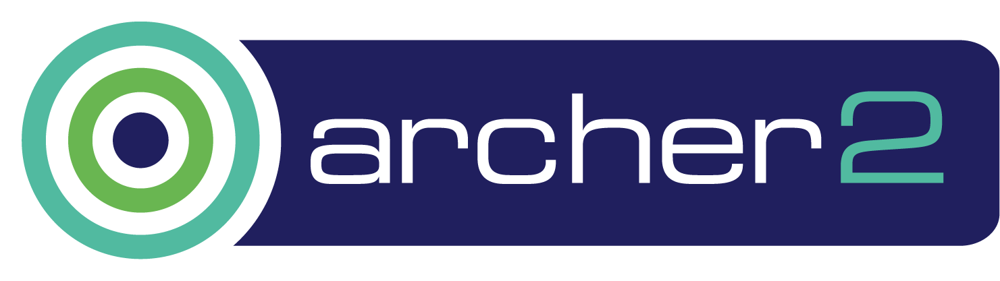
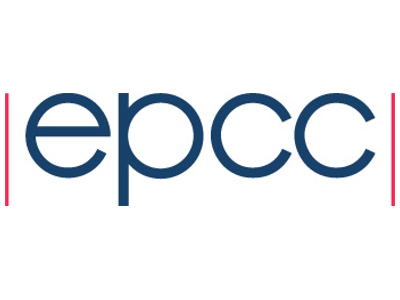

 

    

# ARCHER2 Advanced OpenMP course

[![CC BY-NC-SA 4.0][cc-by-nc-sa-shield]][cc-by-nc-sa]

OpenMP is the industry standard for shared-memory programming, which enables serial programs to be parallelised using compiler directives.This course is aimed at programmers seeking to deepen their understanding of OpenMP and explore some of its more recent and advanced features.

This course will cover topics including nested parallelism, OpenMP tasks, the OpenMP memory model, performance tuning, hybrid OpenMP + MPI, accelerator offloading and recently added features in OpenMP.

Hands-on practical programming exercises make up a significant, and integral, part of this course.

Attendees should be familiar with the basics of OpenMP, including parallel regions, data scoping, work sharing directives and synchronisation constructs. Access will be given to appropriate hardware for all the exercises, although many of them can also be performed on a standard Linux laptop.

## Course timetable

* Tues 18th  (10:00 - 12:00) Tasks, Nested parallelism, Memory model

* Thur 20th (10:00 - 12:00) OpenMP tips, tricks and pitfalls, Performance issues


* Tues 25th  (10:00 - 12:00) OpenMP + MPI 

* Thur 27th (10:00 - 12:00) Newer features in OpenMP 

## Course requirements

All attendees will need their own desktop or laptop.

If you are logging on to an external system then you will need to have an ssh client installed which comes as default for Linux and Mac systems.

Linux users should open a command-line terminal and use ssh from the command line.

Mac can open the Mac termimal application and use ssh from the command line. However, to display graphics from Cirrus you will also need to install Xquartz. Xquartz provides its own terminal called “Xterm”: if you have problems displaying graphics when using the Mac terminal, try logging in using ssh from within this Xterm.

Windows users should install MobaXterm which provides ssh access, a Unix graphics client and a drag-and-drop file browser.

---

This work is licensed under a
[Creative Commons Attribution-NonCommercial-ShareAlike 4.0 International License][cc-by-nc-sa].

[cc-by-nc-sa]: http://creativecommons.org/licenses/by-nc-sa/4.0/
[cc-by-nc-sa-image]: https://licensebuttons.net/l/by-nc-sa/4.0/88x31.png
[cc-by-nc-sa-shield]: https://img.shields.io/badge/License-CC%20BY--NC--SA%204.0-lightgrey.svg

[![CC BY-NC-SA 4.0][cc-by-nc-sa-image]][cc-by-nc-sa]
